# Prep: Introduction to SQL

## SQL Practice

1. Download the free e-book, [Learn SQL](https://landing.chartio.com/download-learn-sql), which is an excellent introduction to SQL and relational databases.

   - SQL stands for **Structured Query Language**, it’s a search language to instruct a database about what information to be retrieved from it
   - **SELECT** is the first instruction needed for any SQL statement that’s fetching data
   - Use **FROM** to specify where the data comes from
   - To get all columns, use * referred to as **Splat**
   - By default results are returned in the order that they’re stored in the database. Use **ORDER BY** command at the end of queries to sort results. By default things are sorted by ascending order. You can choose to reverse that order by specifying DESC, for descending and ASC for ASCending
   - To LIMIT the number of results to return, use the **LIMIT** command with a number of rows to LIMIT by. You can also specify an **OFFSET** from where to start returning data.
   - The word **SCHEMA** is used to describe a collection of tables and their relationships in the database and may have several different schemas. When you’re working with a set of data, it’s useful to be able to browse that schema to get a sense for what data is available to you.
   - Use **WHERE** to filter down result sets and Conditions are statements that are either true or false
   - **Like** is the way to match a string to a pattern. A pattern is a string that can use some special symbols that represent wildcard characters.
   - If you want your pattern to not care about whether characters are upper or lower case you can use **ILIKE**. The I stands for “case (I)nsensitive”.
   - **Null** cells are empty cells in a database. To fetch, use **IS NULL** or **IS NOT NULL**

2. Practice running common SQL commands using the following SQL Bolt tutorials.

   - Lessons 1 through 6 - SQL Queries
     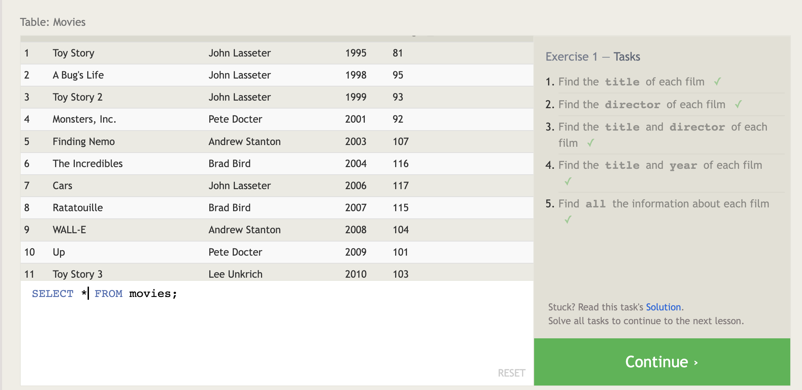
     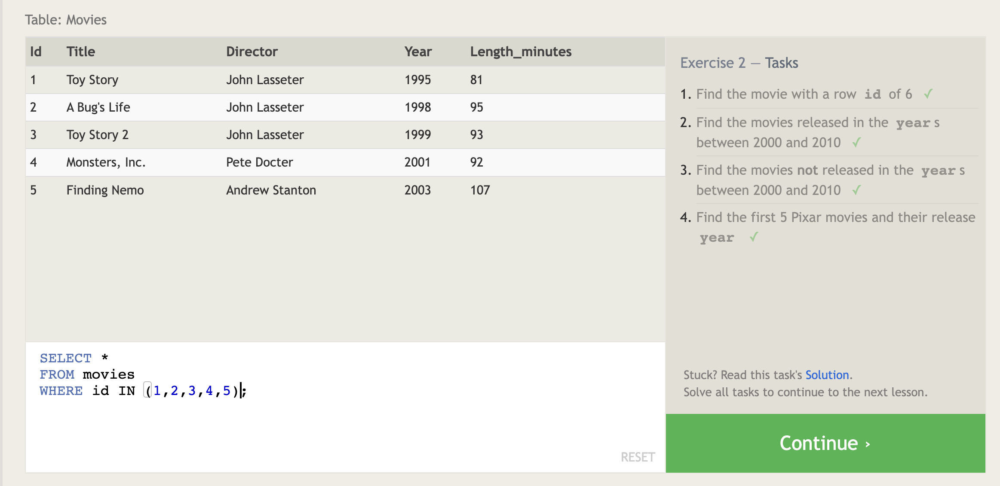
     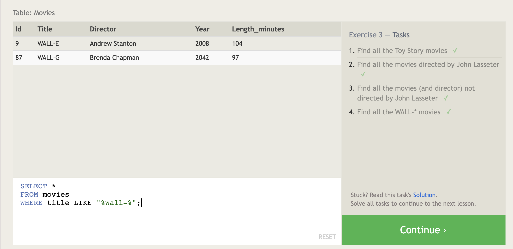
     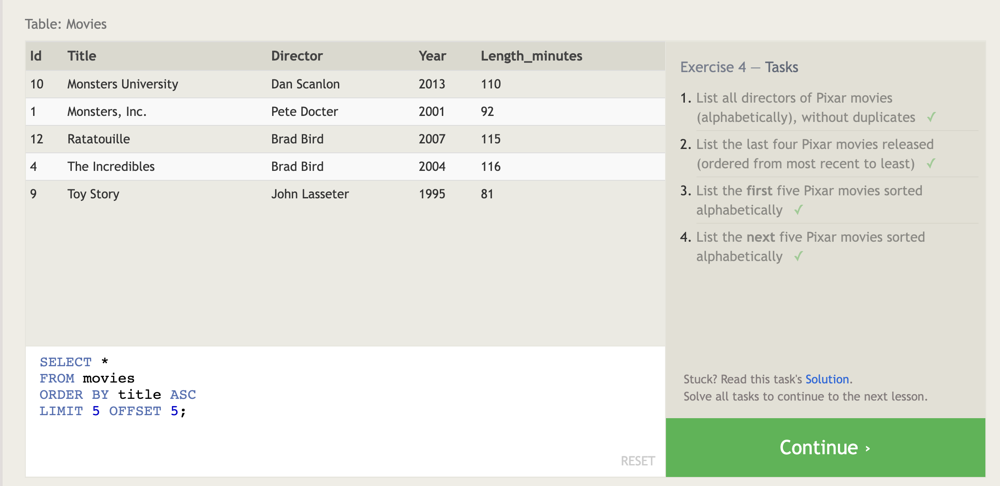
     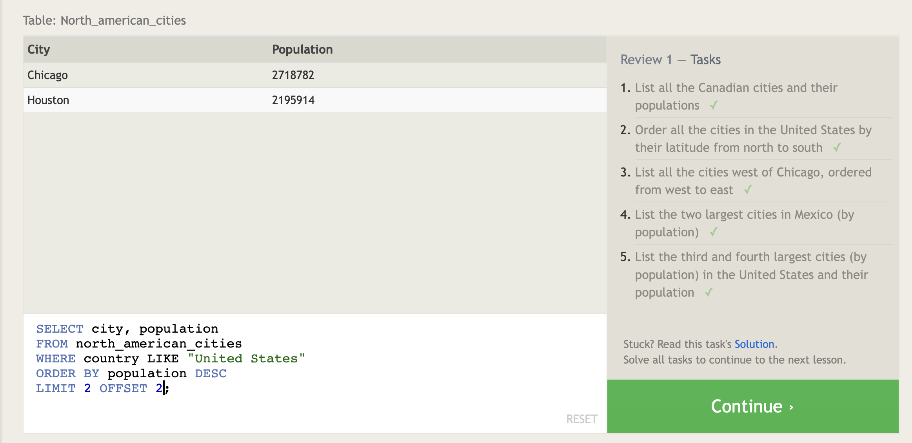
     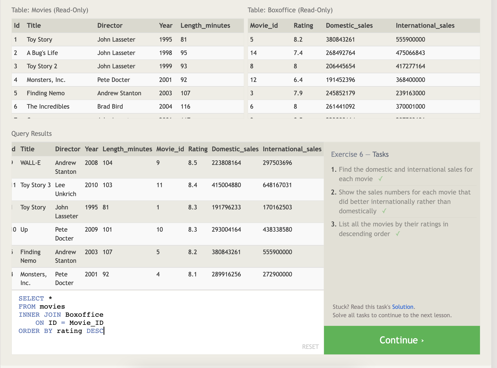

   - Lessons 13 through 18 - Database Management
     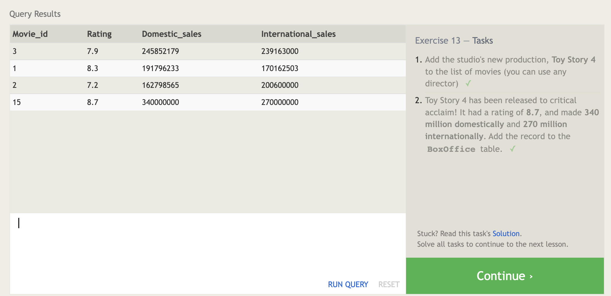
     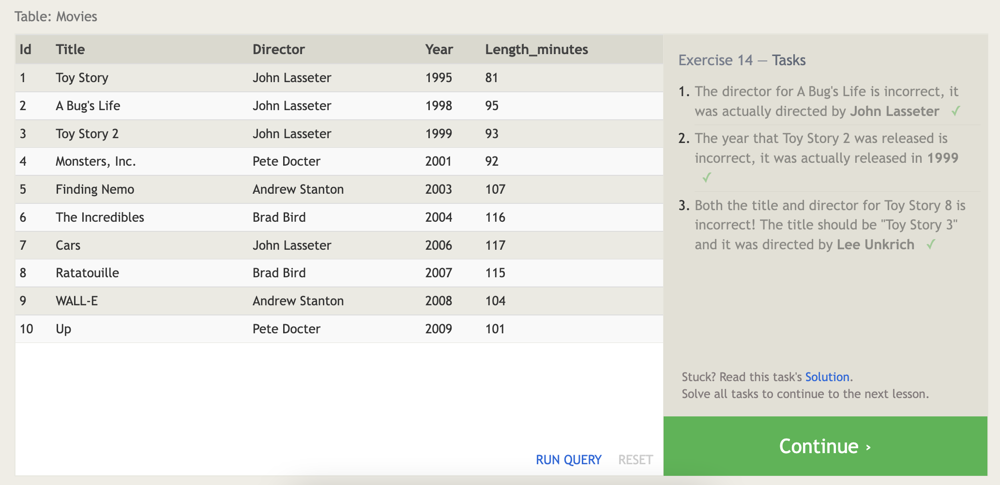
     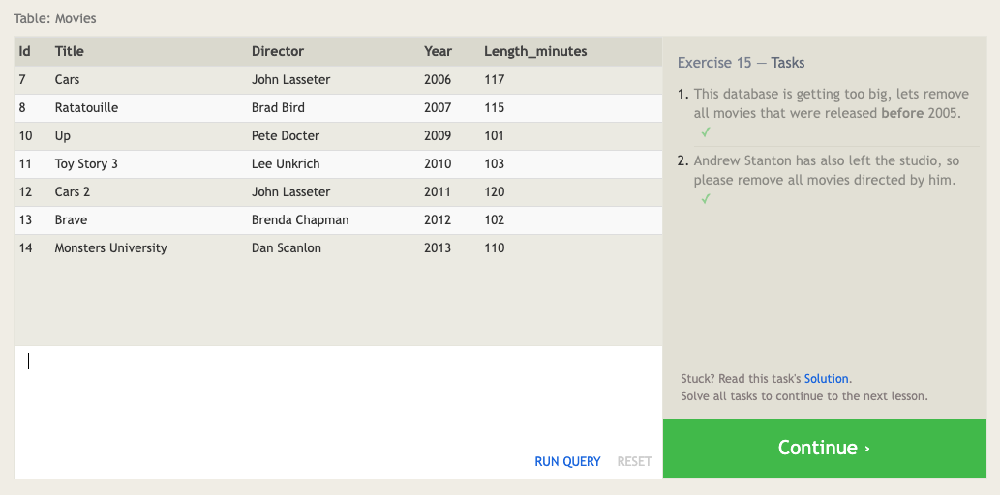
     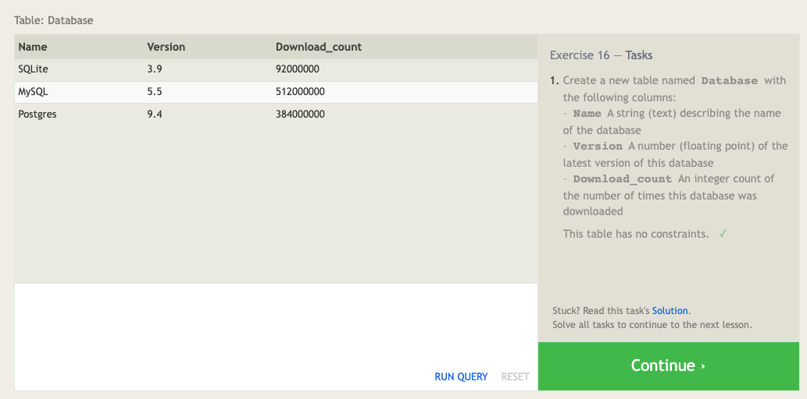
     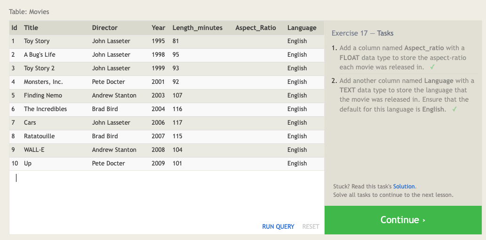
     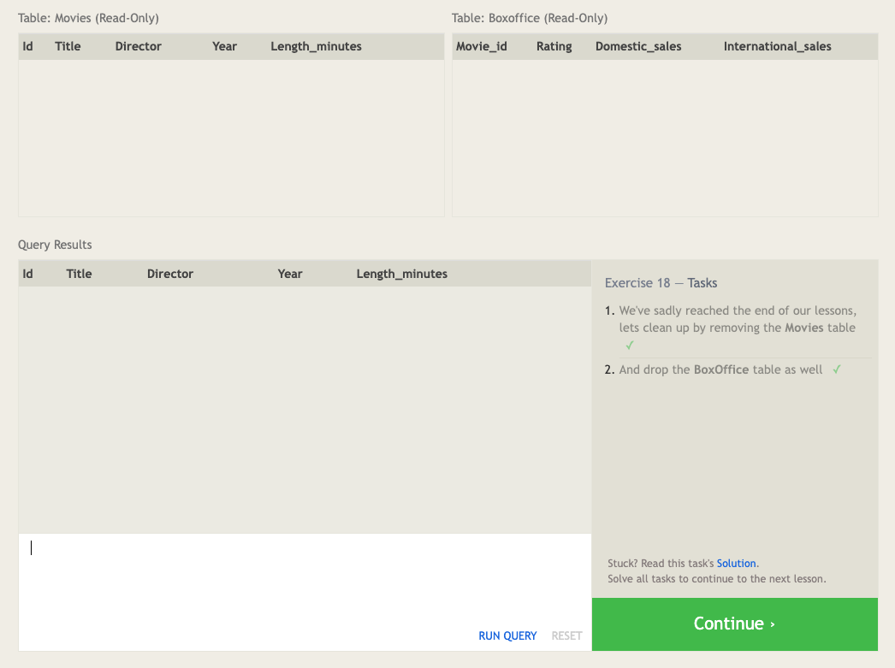
